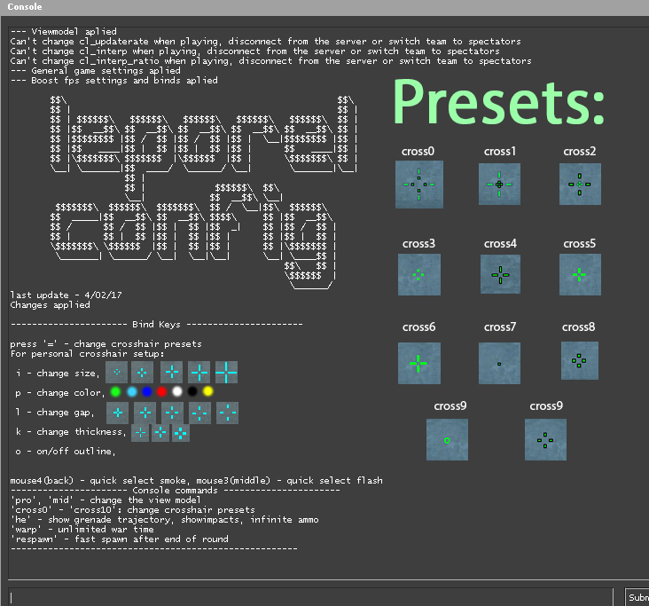

# cfg

## How to use this config  

 Move this file to `..\SteamApps\common\Counter-Strike Global Offensive\csgo\cfg`
 after enter in game console - `exec autoexec`  and you will see new available commands. You can change alias like you want,  
 for example, you can make 'cfg' alias for your settings.
  
## Customize

 Alias is a command that is used to give a command or a chain of commands a custom name. Look at it like creating your own console commands using existing commands.
 Bind - is the command that you use to link a console command to a key.

